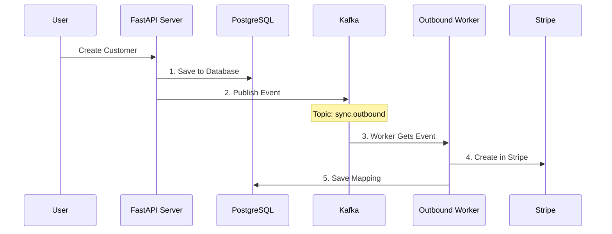
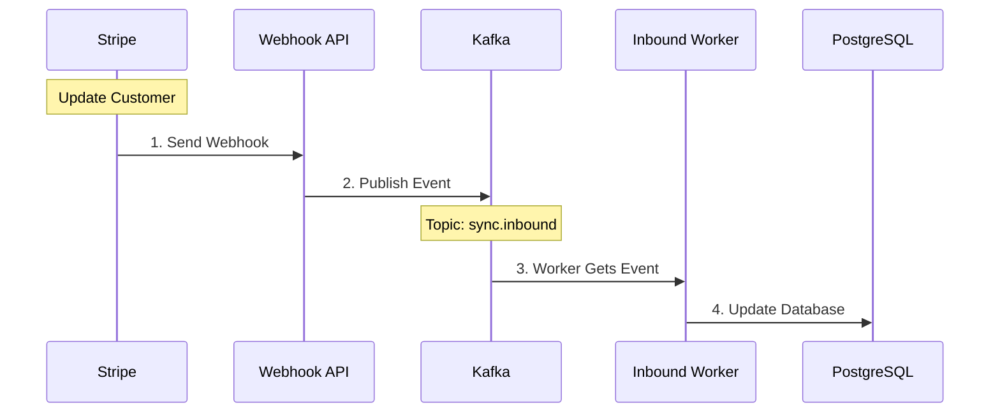

# System Architecture: How It Works

## Understanding the Flow

### 1. Outbound Sync (Your System → Stripe)
When you create a customer in your system:



**What happens step by step:**
1. User creates customer through API
2. Customer is saved in our database
3. Event is sent to Kafka queue
4. Worker picks up the event
5. Worker creates customer in Stripe
6. Mapping is saved (Your ID ↔ Stripe ID)

### 2. Inbound Sync (Stripe → Your System)
When someone updates a customer in Stripe:



**What happens step by step:**
1. Someone updates customer in Stripe
2. Stripe sends webhook to our API
3. API publishes event to Kafka
4. Worker gets the event
5. Worker updates our database

### 3. How The Code Works

#### A. Creating a Customer (Outbound Sync)
```python
# 1. API receives request (src/api/routes/customers.py)
@router.post("/customers")
async def create_customer(customer_data: CustomerCreate):
    # Save to database
    customer = Customer(**customer_data)
    db.add(customer)
    await db.commit()
    
    # Publish event to Kafka
    await kafka_client.produce_message(
        "sync.outbound",
        {"event_type": "customer.created", "customer_data": customer.dict()}
    )

# 2. Worker processes event (src/workers/outbound_sync.py)
async def process_message(self, message):
    # Get customer data from event
    customer_data = message["customer_data"]
    
    # Create in Stripe
    stripe_id = await stripe.Customer.create(
        name=customer_data["name"],
        email=customer_data["email"]
    )
    
    # Save mapping
    mapping = ExternalMapping(
        internal_customer_id=customer_data["id"],
        external_system="stripe",
        external_id=stripe_id
    )
    await db.add(mapping)
    await db.commit()
```

#### B. Receiving Stripe Updates (Inbound Sync)
```python
# 1. Webhook receives update (src/api/routes/webhooks.py)
@router.post("/webhooks/stripe")
async def stripe_webhook(request: Request):
    # Verify webhook
    event = stripe.Webhook.construct_event(
        payload, sig_header, webhook_secret
    )
    
    # Publish to Kafka
    await kafka_client.produce_message(
        "sync.inbound",
        {"event_type": event.type, "data": event.data}
    )

# 2. Worker processes update (src/workers/inbound_sync.py)
async def process_message(self, message):
    # Get customer data
    stripe_customer = message["data"]["object"]
    
    # Find internal customer
    mapping = await ExternalMapping.get(
        external_system="stripe",
        external_id=stripe_customer["id"]
    )
    
    # Update our database
    customer = await Customer.get(mapping.internal_customer_id)
    customer.name = stripe_customer["name"]
    customer.email = stripe_customer["email"]
    await db.commit()
```

### 4. Error Handling & Monitoring

#### A. What if Something Goes Wrong?
```python
# Workers have retry logic
async def process_message(self, message):
    try:
        # Try to process
        await self.handle_event(message)
    except TemporaryError:
        # Will retry later
        raise RetryableError()
    except PermanentError:
        # Log and skip
        logger.error(f"Failed to process: {error}")

# Track sync status
async def track_sync(self, event_type, status, error=None):
    await SyncEvent.create(
        event_type=event_type,
        status=status,
        error_message=error
    )
```

#### B. How to Monitor the System
1. **Check API Logs**
   ```bash
   docker logs zenskar-api
   ```
   Shows:
   - Incoming requests
   - Webhook reception
   - Event publishing

2. **Check Worker Logs**
   ```bash
   docker logs zenskar-worker
   ```
   Shows:
   - Event processing
   - Stripe API calls
   - Sync status

3. **Check Database**
   ```sql
   -- See sync status
   SELECT * FROM sync_events ORDER BY created_at DESC LIMIT 5;
   
   -- Check mappings
   SELECT * FROM external_mappings;
   ```

#### C. Common Issues and Solutions
1. **Webhook Not Received**
   - Check ngrok status
   - Verify webhook URL in Stripe
   - Check API logs

2. **Sync Failed**
   - Check worker logs
   - Verify Stripe API keys
   - Check database connection

### 5. Models (`src/models/`)
- Data models and schemas
- Key files:
  ```
  src/models/
  ├── customer.py         - Customer model
  ├── external_mapping.py - Integration mappings
  └── sync_event.py      - Sync event tracking
  ```

## Event Flow Architecture

### 1. Outbound Sync (Internal → Stripe)
```
User Action          → Create/Update customer via API
API Processing       → Save to database
                    → Publish to sync.outbound topic
Background Worker    → Process sync.outbound event
                    → Transform data for Stripe
                    → Create/Update in Stripe
                    → Save external mapping
```

### 2. Inbound Sync (Stripe → Internal)
```
Stripe Action        → Customer updated in Stripe
Webhook Processing   → Receive webhook event
                    → Publish to sync.inbound topic
Background Worker    → Process sync.inbound event
                    → Transform Stripe data
                    → Update internal customer
                    → Log sync event
```

## Kafka Topics
```
sync.inbound   - Events from external systems
sync.outbound  - Events to external systems
```

## Database Schema
```sql
-- Customer table
CREATE TABLE customers (
    id SERIAL PRIMARY KEY,
    name VARCHAR NOT NULL,
    email VARCHAR NOT NULL UNIQUE,
    created_at TIMESTAMP WITH TIME ZONE DEFAULT NOW(),
    updated_at TIMESTAMP WITH TIME ZONE DEFAULT NOW()
);

-- External mappings
CREATE TABLE external_mappings (
    id SERIAL PRIMARY KEY,
    internal_customer_id INTEGER REFERENCES customers(id),
    external_system VARCHAR NOT NULL,
    external_id VARCHAR NOT NULL,
    created_at TIMESTAMP WITH TIME ZONE DEFAULT NOW()
);

-- Sync events
CREATE TABLE sync_events (
    id SERIAL PRIMARY KEY,
    event_id UUID NOT NULL,
    event_type VARCHAR NOT NULL,
    entity_type VARCHAR NOT NULL,
    entity_id INTEGER NOT NULL,
    external_system VARCHAR NOT NULL,
    status VARCHAR NOT NULL,
    payload JSONB,
    error_message VARCHAR,
    retry_count INTEGER DEFAULT 0,
    created_at TIMESTAMP WITH TIME ZONE DEFAULT NOW(),
    processed_at TIMESTAMP WITH TIME ZONE
);
```
