# 🚀 Zenskar Two-Way Integration System

<div align="center">

**A real-time, event-driven system for seamless bi-directional synchronization of customer data between an internal catalog and Stripe.**

[](https://fastapi.tiangolo.com/)
[](https://postgresql.org/)
[](https://kafka.apache.org/)
[](https://docker.com/)
[](https://stripe.com/)

</div>

---

## 📋 Table of Contents

- [🎯 Project Overview](#-project-overview)
- [🏗️ Architecture](#️-architecture)
- [🚀 Quick Start](#-quick-start)
- [🔧 Testing the Integration](#-testing-the-integration)
- [🐳 Docker Container Architecture](#-docker-container-architecture)
- [📊 System Components](#-system-components)
- [🔄 Sync Flow Details](#-sync-flow-details)
- [🚀 Future Extensions](#-future-extensions)
- [🔒 Security Considerations](#-security-considerations)

---

## 🎯 Project Overview

This system implements **enterprise-grade two-way synchronization** between your internal customer database and Stripe's customer catalog. Changes in either system are automatically propagated to the other in near real-time using webhooks and background workers.

### ✨ Key Features

<table>
<tr>
<td>

**🔄 Real-time Sync**  
Instant data consistency across platforms

</td>
<td>

**⚡ Event-Driven**  
Scalable architecture for high-volume operations

</td>
</tr>
<tr>
<td>

**🛡️ Fault-Tolerant**  
Robust error handling and retry mechanisms

</td>
<td>

**🔧 Extensible**  
Ready for Salesforce, QuickBooks, and more

</td>
</tr>
</table>

### ✅ Implementation Status

<details>
<summary><strong>Core Requirements</strong></summary>

- [x] **Customer Table** - PostgreSQL with ID, name, email columns
- [x] **Stripe Integration** - Free test account with two-way sync
- [x] **Kafka Queue** - Docker-based event processing
- [x] **Outbound Sync** - Internal → Stripe via background workers
- [x] **Inbound Sync** - Stripe → Internal via webhooks (ngrok)
- [x] **Extensible Architecture** - Ready for Salesforce and other integrations

</details>

<details>
<summary><strong>Technical Implementation</strong></summary>

- [x] **FastAPI** - REST API with CRUD operations
- [x] **PostgreSQL** - Relational database with proper schema
- [x] **Kafka** - Event streaming and message queues
- [x] **Docker** - Containerized deployment
- [x] **Webhook Processing** - Real-time event handling
- [x] **Error Handling** - Retry logic and status tracking
- [x] **Monitoring** - Comprehensive logging and status tracking

</details>

---

## 🏗️ Architecture

<div align="center">


</div>

---

## 🚀 Quick Start

<div align="center">

📖 **[Complete Installation Guide](./INSTALLATION.MD)** | 🎥 **[Demo Video](https://drive.google.com/file/d/1sAgZcDdb8oNkmtQMD3AiqAmrW9-QuRuY/view?usp=sharing)**

</div>

### ⚡ Quick Setup

```bash
git clone https://github.com/Shashankpantiitbhilai/zenskar-backend-assignment.git
cd zenskar-backend-assignment
```

### 🔍 API Health Check

```bash
curl http://localhost:8000/health
# Expected: {"status": "healthy"}
```

---

## 🔧 Testing the Integration

### 📋 Interactive API Documentation

<div align="center">

🎯 **[Swagger UI](http://localhost:8000/docs)** | 📚 **[ReDoc](http://localhost:8000/redoc)**

</div>

### 🔄 Outbound Sync Testing (Internal → Stripe)

<details>
<summary><strong>Option 1: Using cURL</strong></summary>

```bash
curl -X POST http://localhost:8000/api/v1/customers \
  -H "Content-Type: application/json" \
  -d '{
    "name": "John Doe", 
    "email": "john.doe@example.com"
  }'
```

</details>

<details>
<summary><strong>Option 2: Using Swagger UI (Recommended)</strong></summary>

1. Open **http://localhost:8000/docs**
2. Find `POST /api/v1/customers` endpoint
3. Click **"Try it out"**
4. Enter customer data:
   ```json
   {
     "name": "Jane Smith",
     "email": "jane.smith@example.com"
   }
   ```
5. Click **"Execute"**
6. Verify customer creation in response

</details>

### 🔽 Inbound Sync Testing (Stripe → Internal)

<details>
<summary><strong>Option 1: Using Stripe Dashboard (Recommended)</strong></summary>

1. Go to [Stripe Dashboard](https://dashboard.stripe.com/test/customers)
2. Click **"Add customer"**
3. Fill in customer details
4. Save the customer
5. Check your internal system for the synced customer

</details>

<details>
<summary><strong>Option 2: Using Stripe CLI</strong></summary>

```bash
stripe customers create \
  --name="Bob Wilson" \
  --email="bob.wilson@example.com"
```

</details>

### 📊 API Endpoints Reference

| Method | Endpoint | Description | Response |
|--------|----------|-------------|----------|
| `GET` | `/api/v1/customers` | List all customers with pagination | `CustomerResponse[]` |
| `GET` | `/api/v1/customers/{id}` | Get customer by ID with external mappings | `CustomerWithMappings` |
| `POST` | `/api/v1/customers` | Create new customer (triggers outbound sync) | `CustomerResponse` |
| `PUT` | `/api/v1/customers/{id}` | Update customer (triggers outbound sync) | `CustomerResponse` |
| `DELETE` | `/api/v1/customers/{id}` | Delete customer (triggers outbound sync) | `204 No Content` |
| `POST` | `/api/v1/webhooks/stripe` | Stripe webhook handler (triggers inbound sync) | `200 OK` |
| `GET` | `/health` | Health check endpoint | `{"status": "healthy"}` |

### 🔍 Watch the Sync Process

```bash
# 👀 Watch worker logs
docker logs -f zenskar-worker

# 🔍 Monitor API logs  
docker logs -f zenskar-api
```

---

## 🐳 Docker Container Architecture

The system deploys as a **containerized event-driven architecture** using Docker Compose, with six containers orchestrated to provide real-time two-way synchronization.

### Container Topology

```mermaid
graph LR
    subgraph Docker["🐳 Docker Network"]
        API[🚀 API<br/>Port: 8000]:::api
        WORKER[⚙️ Worker<br/>Background]:::worker
        DB[(🗄️ Database<br/>Port: 5432)]:::db
        KAFKA[📨 Kafka<br/>Port: 9093]:::kafka
        ZK[🔧 ZooKeeper<br/>Port: 2181]:::zk
        SETUP[⚡ Setup<br/>Init Only]:::setup
    end
    
    API --> DB
    API --> KAFKA
    WORKER --> KAFKA
    WORKER --> DB
    KAFKA --> ZK
    SETUP -.-> KAFKA

    classDef api fill:#4CAF50,stroke:#2E7D32,stroke-width:2px,color:#fff
    classDef worker fill:#FF9800,stroke:#E65100,stroke-width:2px,color:#fff
    classDef db fill:#2196F3,stroke:#1565C0,stroke-width:2px,color:#fff
    classDef kafka fill:#9C27B0,stroke:#6A1B9A,stroke-width:2px,color:#fff
    classDef zk fill:#795548,stroke:#5D4037,stroke-width:2px,color:#fff
    classDef setup fill:#607D8B,stroke:#455A64,stroke-width:2px,color:#fff
```

<div align="center">



</div>

### Container Specifications

<details>
<summary><strong>🚀 API Container (zenskar-api)</strong></summary>

- **Function**: HTTP REST API server and webhook endpoint
- **Technology**: FastAPI with Uvicorn ASGI server
- **Network**: Exposes port 8000 for external traffic
- **Dependencies**: PostgreSQL for persistence, Kafka for event publishing
- **Resource Profile**: CPU-bound during request processing, moderate memory usage

```bash
# Monitor API container
docker logs -f zenskar-api
docker stats zenskar-api
```

</details>

<details>
<summary><strong>⚙️ Worker Container (zenskar-worker)</strong></summary>

- **Function**: Background event processor for sync operations
- **Technology**: Kafka consumer with Python asyncio
- **Network**: Internal only, no exposed ports
- **Dependencies**: Kafka for event consumption, PostgreSQL for state updates, Stripe API
- **Resource Profile**: I/O-bound with periodic CPU spikes during sync operations

```bash
# Monitor worker processing
docker logs -f zenskar-worker
```

</details>

<details>
<summary><strong>🗄️ Database Container (zenskar-postgres)</strong></summary>

- **Function**: Primary data persistence layer
- **Technology**: PostgreSQL 14 with initialized schema
- **Network**: Port 5432 exposed for development access
- **Persistence**: Volume-mounted data directory for durability
- **Resource Profile**: Memory-intensive for caching, I/O-bound for queries

```bash
# Access database directly
docker exec -it zenskar-postgres psql -U zenskar_user -d zenskar_db
```

</details>

<details>
<summary><strong>📨 Message Broker Container (zenskar-kafka)</strong></summary>

- **Function**: Event streaming and message queue management
- **Technology**: Apache Kafka with KRaft mode
- **Network**: Port 9093 exposed for external producer/consumer access
- **Topics**: sync.inbound, sync.outbound
- **Resource Profile**: Network and disk I/O intensive, moderate CPU usage

```bash
# Monitor Kafka topics and messages
docker exec -it zenskar-kafka kafka-topics --bootstrap-server localhost:9093 --list
docker exec -it zenskar-kafka kafka-console-consumer --bootstrap-server localhost:9093 --topic sync.outbound
```

</details>

### Container Interaction Flow

```mermaid
sequenceDiagram
    participant Client as 👤 Client
    participant API as 🚀 API
    participant DB as 🗄️ Database
    participant Kafka as 📨 Kafka
    participant Worker as ⚙️ Worker
    participant Stripe as 💳 Stripe

    Client->>API: Create Customer
    API->>DB: Save Customer
    API->>Kafka: Publish Event
    Kafka->>Worker: Process Event
    Worker->>Stripe: Sync to Stripe
    Worker->>DB: Update Mapping
```

<div align="center">



</div>

---

## 📊 System Components

<table>
<tr>
<td width="50%">

### 🖥️ API Server (`src/api/`)
- **FastAPI** REST API server
- **Customer CRUD** operations
- **Webhook handlers** for Stripe events
- **Event publishing** to Kafka

### ⚙️ Background Workers (`src/workers/`)
- **Outbound Sync Worker**: Internal → Stripe
- **Inbound Sync Worker**: Stripe → Internal DB
- **Error handling** and retry logic

</td>
<td width="50%">

### 🔌 Integration Layer (`src/integrations/`)
- **Base Integration Interface**: Abstract class
- **Stripe Integration**: Concrete implementation
- **Extensible design** for more integrations

### 📋 Data Models (`src/models/`)
- **Customer**: Core customer entity
- **External Mapping**: Links internal↔external IDs
- **Sync Event**: Tracks synchronization status

</td>
</tr>
</table>

---

## 🔄 Sync Flow Details

### 🔄 Outbound Sync (Internal → Stripe)

<div align="center">


</div>

**Backend Flow Steps:**
1. **API Layer** - Receives HTTP request, validates data
2. **Database Transaction** - Saves customer to PostgreSQL with auto-generated ID
3. **Event Publishing** - Publishes event to Kafka `sync.outbound` topic
4. **Worker Processing** - OutboundSyncWorker consumes event asynchronously
5. **External API Call** - Worker calls Stripe API to create customer
6. **Mapping Storage** - Stores internal↔external ID mapping
7. **Status Tracking** - Updates sync event status for monitoring

### 🔽 Inbound Sync (Stripe → Internal)

```mermaid
sequenceDiagram
    participant Stripe as 💳 Stripe
    participant Webhook as 🌐 Webhook
    participant API as 🚀 API
    participant Kafka as 📨 Kafka
    participant Worker as ⚙️ Worker
    participant DB as 🗄️ Database

    Note over Stripe: Customer created in Stripe Dashboard
    
    Stripe->>Webhook: Send Webhook Event
    Webhook->>API: POST /webhooks/stripe
    API->>Kafka: Publish Event
    API-->>Webhook: 200 OK
    
    Note over Kafka,Worker: Background Processing
    
    Kafka->>Worker: Consume Event
    Worker->>DB: Save Customer
    Worker->>DB: Save Mapping (stripe_id ↔ internal_id)
```

<div align="center">



</div>

**Backend Flow Steps:**
1. **External Change** - Customer created/updated in Stripe dashboard
2. **Webhook Delivery** - Stripe sends HTTP POST to ngrok URL
3. **Signature Verification** - Webhook handler verifies Stripe signature
4. **Event Publishing** - Publishes verified event to Kafka `sync.inbound` topic
5. **Worker Processing** - InboundSyncWorker consumes event asynchronously
6. **Mapping Check** - Checks if customer already exists via external mapping
7. **Database Update** - Creates/updates customer in internal database
8. **Mapping Creation** - Creates new mapping if customer is new
9. **Status Tracking** - Records sync event for monitoring

### 🛡️ Error Handling Flow

```mermaid
sequenceDiagram
    participant Worker as ⚙️ Worker
    participant Stripe as 💳 Stripe
    participant DB as 🗄️ Database

    Worker->>Stripe: Create Customer
    Stripe-->>Worker: ❌ Rate Limited (429)
    
    Worker->>DB: Mark as Failed
    Worker->>Worker: Wait & Retry
    Worker->>Stripe: Create Customer (Retry)
    Stripe-->>Worker: ✅ Success (200)
    Worker->>DB: Mark as Completed
```

<div align="center">



</div>

**Error Scenarios Handled:**
- **Rate Limiting** - Exponential backoff retry
- **Network Timeouts** - Automatic retry with backoff
- **Invalid Data** - Log error and skip (no retry)
- **Webhook Verification** - Reject invalid signatures
- **Duplicate Events** - Idempotency checks prevent duplicates

---

## 🚀 Future Extensions

### 🏢 Planned Integrations

<table>
<tr>
<td>

**🏢 Salesforce Integration**  
Complete CRM synchronization with contact and opportunity management

</td>
<td>

**📄 Invoice Catalog Integration**  
Automated billing workflows with payment processors

</td>
</tr>
<tr>
<td>

**🔧 Additional External Systems**  
Framework for adding new payment providers and CRM platforms

</td>
<td>

**📊 Analytics & Monitoring**  
Real-time sync metrics and performance dashboards

</td>
</tr>
</table>

> 📝 **For detailed integration plans**, see [Integration Plans](./INTEGRATION_PLANS.md)

### 🔧 Adding New Features

1. **Models** - Add new SQLAlchemy models in `src/models/`
2. **API Routes** - Add endpoints in `src/api/routes/`
3. **Workers** - Create workers in `src/workers/`
4. **Integrations** - Add integrations in `src/integrations/`

---

## 🔒 Security Considerations

<table>
<tr>
<td>

**🔐 Webhook Verification**  
All Stripe webhooks verified using webhook secrets

**🌍 Environment Variables**  
Sensitive data stored in environment variables

</td>
<td>

**🔑 API Keys**  
Stripe keys are test keys, rotate for production

**🗄️ Database Security**  
PostgreSQL with proper connection pooling

</td>
</tr>
</table>

---

<div align="center">

[](https://fastapi.tiangolo.com/)
[](https://postgresql.org/)
[](https://kafka.apache.org/)
[](https://docker.com/)

</div>
